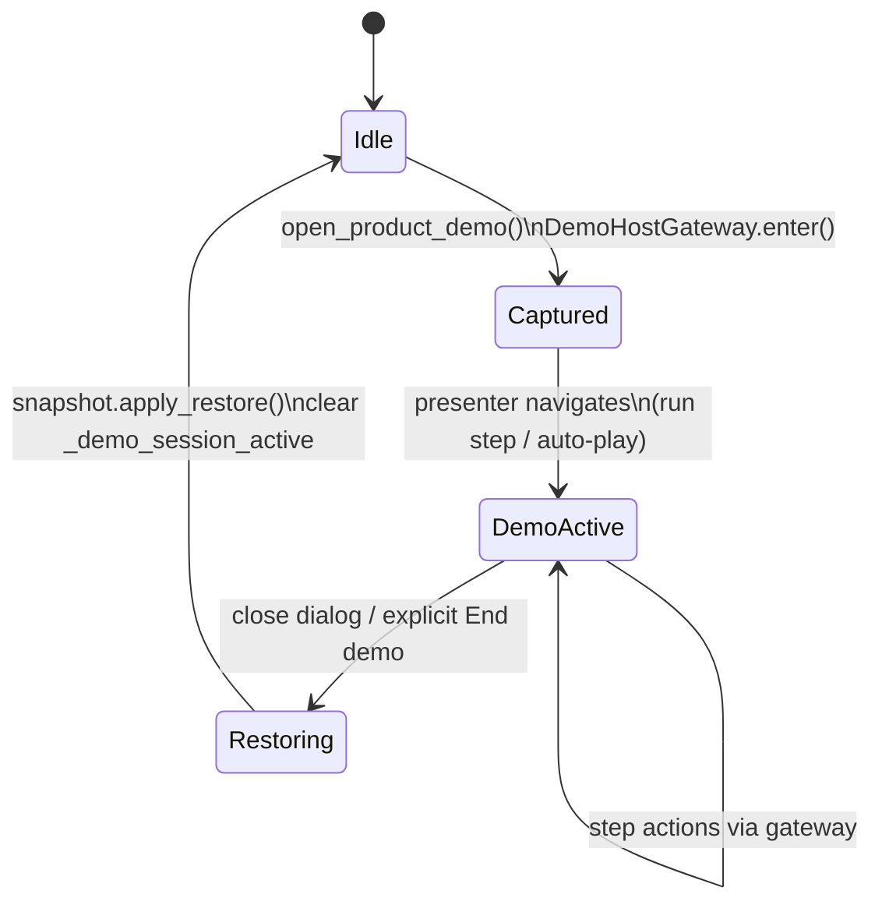

# Contract: Product Demo State Isolation

**Feature**: `008-ui-journey-modernization`  
**Spec**: FR-301–306, SC-201–203  
**Consumers**: `ui/demo.py`, `ui/demo_snapshot.py` (new), `ui/mixin.py` (guards)

## Purpose

Presenter **Product demo** (`View → Product demo`, survey bar **Demo**) MUST NOT leave the operator’s live COM/network/NMEA/preset/bridge state changed after close. Demo script state (step, phase, timers) MUST remain isolated from Connect panel disclosure geometry.

## Lifecycle



## Public API (Python)

### `ui/demo_snapshot.py`

```python
@dataclass(frozen=True)
class OperatorSessionSnapshot:
    ...

def capture_operator_snapshot(host: QWidget) -> OperatorSessionSnapshot: ...

def restore_operator_snapshot(host: QWidget, snap: OperatorSessionSnapshot) -> None: ...
```

**Requirements**:

- `capture` MUST read current widget values, not prefs files.
- `restore` MUST use existing mixin helpers (`_apply_preset_data`, `_apply_preset_nmea_mode`, start/stop bridge) so behavior matches manual operator actions.
- `restore` MUST complete within 5 s on a typical bench PC (SC-201).
- If `snap.bridge_was_running` and bridge is stopped only because demo started it, `restore` MAY call `start_bridge()` once; if operator was stopped before demo, MUST remain stopped.

### `ui/demo_gateway.py` (or methods on dialog)

```python
class DemoHostGateway:
    def enter(self, host: QWidget) -> None: ...
    def exit(self, host: QWidget) -> None: ...
    def run_action(self, host: QWidget, action: Callable[[QWidget], None] | None) -> None: ...
```

**Requirements**:

- `enter` called exactly once per dialog open before any step action.
- `exit` called from `closeEvent`, `reject`, and application shutdown path if dialog visible.
- `run_action` wraps all `DemoStep.action` and manual `_manual_advance` / `_run_selected` invocations.

## Persistence guards

While `host._demo_session_active is True`:

| Call site | Required behavior |
|-----------|-------------------|
| `bench_config.save_preset` | No-op or deferred (demo must not write `path_presets.json`) |
| `push_recent_session` | No-op |
| `save_connect_panel_prefs` (sizes on drag) | No-op optional; restore overwrites anyway |
| `_persist_web_ui_prefs` | Allowed (unrelated to demo steps) |

## Presenter UI isolation

| State | Owner | Must NOT depend on |
|-------|-------|---------------------|
| Step index, phase, countdown | `ProductDemoDialog` | Connect panel expanded/collapsed |
| Auto-play timer | `DemoRunner` | Connect scroll position |
| Progress bar | Dialog | Host splitter sizes |

## Mock / labeling

- Log lines from demo actions MUST use `[Demo]` prefix (existing).
- Optional: status banner or HUD chip **“Demonstration”** while demo open; MUST clear on `exit`.
- MUST NOT enqueue synthetic NMEA/binary into `bridge_core` for fake fixes.

## Production parity (FR-305)

Demo steps MAY call the same mixin methods as production (`_apply_bench_preset`, `_open_presets_tab`, `start_bridge`, HUD open, diagnostics scripts). After `exit`, host MUST match snapshot, not demo terminal state.

## Failure modes

| Event | Behavior |
|-------|----------|
| Step action raises | Log `[Demo] Step error: …`; continue script; still restore on exit |
| App crash during demo | Next launch uses normal prefs (no partial snapshot file) |
| Demo opens while bridge running | Snapshot records running; restore returns to running unless demo stopped it and policy says otherwise |
| Double open demo | Second open raises existing dialog (`recover_if_stuck`); no second snapshot |

## Verification (local-only — no agent-browser)

### Automated

- `test_demo_snapshot_roundtrip`: capture → mutate widgets → restore → assert field equality.
- `test_demo_does_not_write_presets`: run gateway + boat preset action with temp presets path → file mtime/hash unchanged.
- `test_demo_exit_restores_running_flag`: mock host bridge None/running.

### Manual (`quickstart.md`)

- Record COM, preset, running; run steps `bench`, `tcp_start`, `boat`; close demo; verify match.

## Non-goals

- Rewriting `PRODUCT_DEMO_STEPS` script content
- Web dashboard demo mode
- agent-browser / Playwright regression
